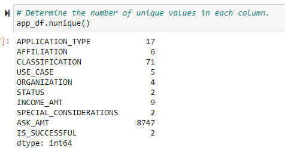
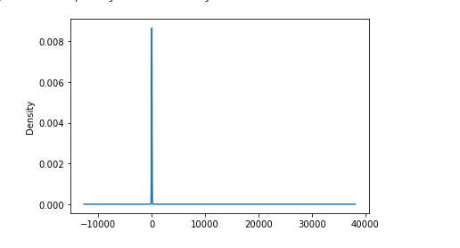
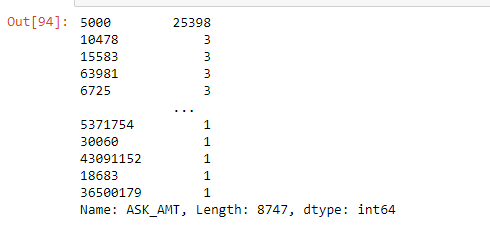
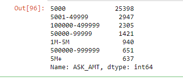

# Neural Network Charity Analysis

## Overview of the analysis

This analysis uses machine learning and neural networks with Tensorflow to predict whether applicants will be successful if funded by Alphabet Soup. The data provided from Alphabet Soup contains 34,000 plus organizations that have received funding. The goal is to reach 75% or higher accuracy.

- With this data, I will:
  - preprocess the data for the neural network
  - complie, train, and evaluate the neural network model
  - conduct additional trainings to optimize the model

- Resources:
  - charity_data.csv
  - Pandas, Python, Jupyter Notebook

## Results

### Data Preprocessing
- First, I dropped the ID columns 'EIN' and 'NAME'
- The 'Classification' and 'Application Type' values are examined to see if bining is needed
- Using One Hot Encoder, the updated data is encoded, then merged
- The data is split and the 'IS_SUCCESSFUL' column is dropped since it's the target 
- Training and testing is scaled and data is standardized

### Compiling, Training, and Evaluating the Model
The deep neural net had 2 layers, the first with 80 neurons, and the second with 30 neurons. The hidden layer activation is 'RELU' and the output activation is 'Sigmoid'. The model was trained with 100 epochs, and every 5 epochs the model's weight was saved. 

The result was 69% accuracy. 

### Optimizing the Model
A second notebook was created 'AlphabetSoupCharity_Optimization' to conduct more models to attempt to increase accuracy.

The following changes to model were:
  - Binning the 'ASK_AMT' column during preprocessing 
    - There were 8,747 unique values in the ASK_AMT column, far more than any other column. Binning was done in groups based on the asking amount from each organization. You can see from the photos below how binning helped scale the data.
    - The original unique values before preprocssing:
    
    
    - Viewing the density plot and value counts of the ASK_AMT column:
    
     
    
    - After binning is complete: 
    
    
    
  - After completing preprocessing, I was able to make changes to compiling the model. These are the changes and results of each attempt:
  A1. The second hidden layer was increased from 30 units to 40 units. The output activation was changed to 'RELU'.
    - The result was 68% accuracy.
  A2. A third hidden layer was added with 20 units
    - The result was 68% accuracy.
  A3. The hidden layer activation was changed to 'Sigmoid'. 
    - The result was 68% accuracy.

## Summary: 
The model could not meet our goal of 75% accuracy. After completing the optimization, the model still didn't meet the goal. 

Since this didn't work, I suggest using a supervised machine learning model, such as decision trees and random forest classifiers. This is because we know the outcome of the data; I dropped the 'IS_SUCCESSFUL' column in the beginning of preprocessing. 

Decision trees would work because the data contains nine columns that categorize the application. This is enough to create a random forest. Multiple algorithms are being used to make predictions, resulting in one final prediction based on the combination of previous predictions.
